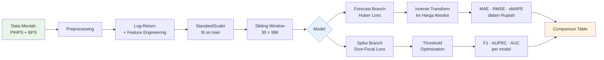
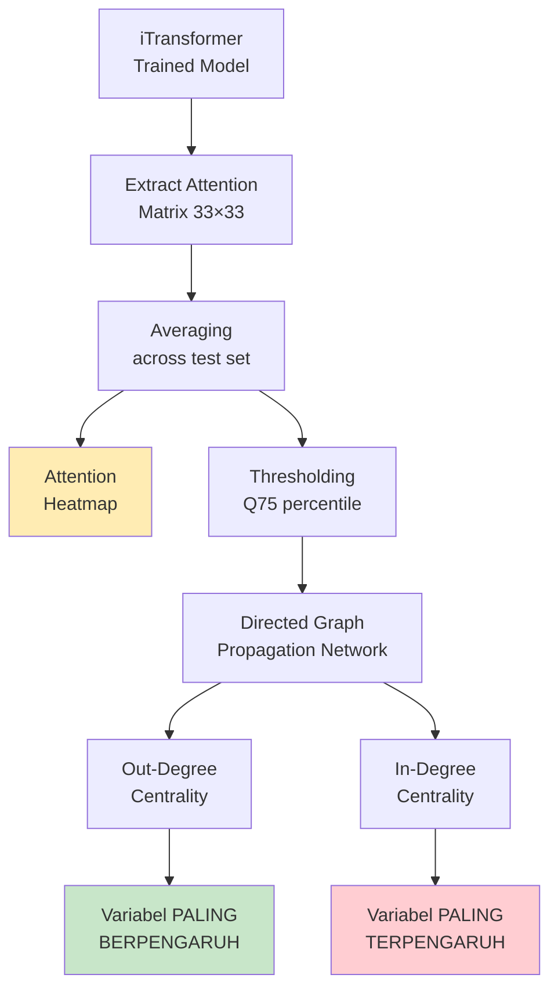
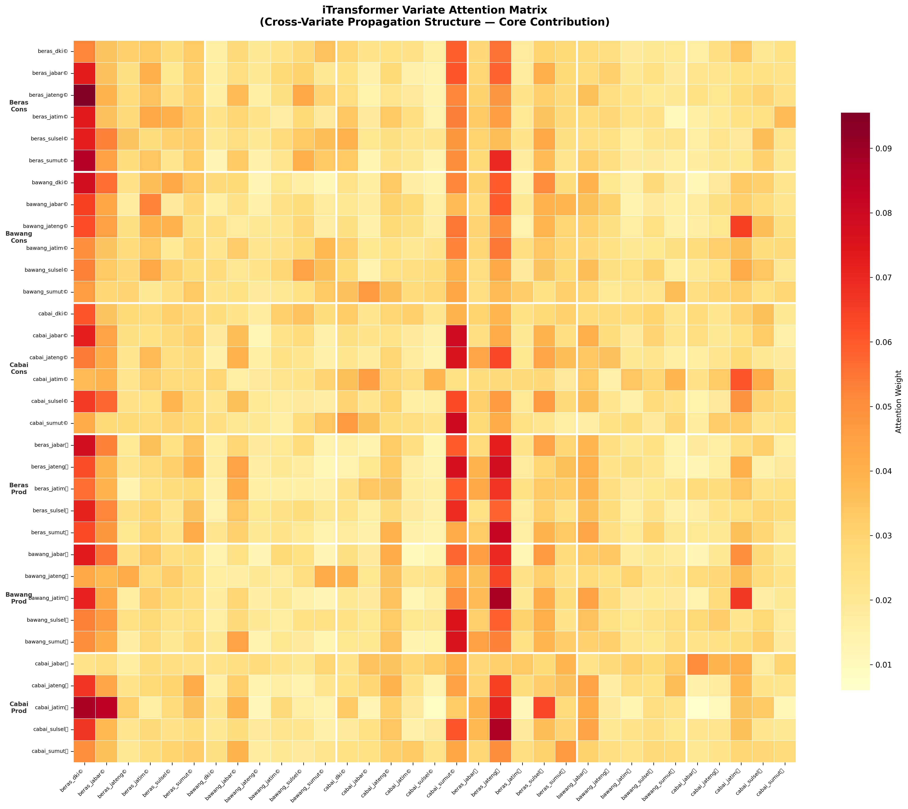

<div align="center">

# 🌾 iTransformer Food Price Propagation

### *Mengungkap Pola Penyebaran Lonjakan Harga Pangan Antar Wilayah di Indonesia Menggunakan iTransformer Berbasis Inverted Attention*

<br>


<br>

*Sistem peramalan harga pangan multivariat dan deteksi lonjakan harga berbasis deep learning,*
*dengan analisis propagasi antar wilayah menggunakan mekanisme attention yang dapat diinterpretasi.*

---

</div>

## 📋 Daftar Isi

- [Ringkasan Proyek](#-ringkasan-proyek)
- [Tujuan Penelitian](#-tujuan-penelitian)
- [Model yang Diimplementasi](#-model-yang-diimplementasi)
- [Deskripsi Dataset](#-deskripsi-dataset)
- [Arsitektur & Pipeline](#-arsitektur--pipeline)
- [Analisis Attention & Propagasi](#-analisis-attention--propagasi)
- [Hasil Eksperimen](#-hasil-eksperimen)
- [Visualisasi](#-visualisasi)
- [Struktur Repositori](#-struktur-repositori)
- [Instalasi & Penggunaan](#-instalasi--penggunaan)
- [Riset Selanjutnya](#-riset-selanjutnya)
- [Penulis](#-penulis)

---

## 🔬 Ringkasan Proyek

Volatilitas harga pangan merupakan ancaman serius bagi ketahanan pangan Indonesia. Lonjakan harga yang tidak terprediksi dapat memicu inflasi, mengganggu daya beli masyarakat, dan menimbulkan ketidakstabilan ekonomi regional. Lebih kritis lagi, lonjakan harga di satu wilayah seringkali *menjalar* ke wilayah lain melalui mekanisme rantai pasok dan arbitrase pasar — namun pola penyebaran ini belum dipahami secara kuantitatif.

Proyek ini membangun **sistem peramalan harga pangan multivariat** yang mampu:

1. **Meramalkan** harga 33 variabel pangan (3 komoditas × 6 provinsi × 2 level harga) secara simultan
2. **Mendeteksi** lonjakan harga (*spike detection*) sebagai sistem peringatan dini
3. **Menganalisis** pola propagasi lonjakan harga antar wilayah melalui matriks attention yang dapat diinterpretasi

Kontribusi utama terletak pada penggunaan arsitektur **iTransformer** (Liu et al., ICLR 2024) yang membalik dimensi attention — menjadikan *variabel* sebagai token alih-alih *timestep* — sehingga secara alami memodelkan ketergantungan antar komoditas dan antar wilayah.

> **Referensi Paper:** Liu, Y., et al. *"iTransformer: Inverted Transformers Are Effective for Time Series Forecasting."* ICLR 2024.

---

## 🎯 Tujuan Penelitian

| No | Tujuan | Pendekatan |
|----|--------|------------|
| 1 | Meramalkan harga pangan multivariat 14 hari ke depan | Multi-task time series forecasting dengan Huber Loss |
| 2 | Mendeteksi lonjakan harga secara dini | Klasifikasi biner dengan Dice-Focal Loss |
| 3 | Memodelkan pola propagasi harga antar wilayah | Inverted attention → directed propagation network |
| 4 | Memberikan interpretabilitas keputusan model | Attention heatmap + centrality analysis |

---

## 🏗️ Model yang Diimplementasi

Empat arsitektur deep learning dibandingkan secara adil (*fair-fight*), seluruhnya didesain dengan jumlah parameter yang setara (~80k–160k) untuk menghindari bias kapasitas model.

| Model | Arsitektur | Mekanisme Utama | Parameter | Kelebihan | Keterbatasan |
|-------|-----------|-----------------|-----------|-----------|-------------|
| **LSTM** | Recurrent | Hidden state propagation | 94,764 | Robust untuk univariat, baseline kuat | Tidak memodelkan cross-variate |
| **PatchTST** | Patch + Transformer | Channel-independent patching | 86,572 | Tangkap pola lokal temporal | Setiap variabel diproses terpisah |
| **Crossformer** | Segment + Two-Stage Attn | Cross-time + cross-variate | 161,452 | Dual-stage attention eksplisit | Lebih kompleks, rentan overfit |
| **iTransformer** | Inverted Transformer | Variate-as-token attention | 83,248 | Interpretable cross-variate + temporal context | Perlu regularisasi kuat |

<details>
<summary><b>Detail Arsitektur iTransformer (Klik untuk expand)</b></summary>

```
Input: x_price (B, 30, 33) + x_temporal (B, 30, 15)
  │
  ├── Gaussian Noise Injection (training only, σ=0.01)
  ├── RevIN Scale-Only Normalization (per-variate)
  ├── Transpose → Variate-as-Token (B, 33, 30)
  ├── Temporal Projection: Linear(30 → 64)
  ├── + Learnable Variate Embedding: nn.Embedding(33, 64)
  ├── + Temporal Context Embedding: MLP(15 → 64) — calendar + events
  ├── + CLS Token
  │
  ├── Temperature-Scaled Attention Layer ×2
  │     └── softmax(QK^T / (τ·√d_k)), τ = learnable
  │     └── RMSNorm (Pre-Norm)
  │     └── FFN: GELU + Dropout(0.2)
  │
  ├── Forecast Head → RevIN Denormalize → (B, 14, 33)
  └── Spike Head (CLS Token) → (B, 30)
```

**Fitur Khusus:**
- **Learnable Temperature (τ):** Parameter yang dipelajari untuk mempertajam distribusi attention
- **RevIN Scale-Only:** Normalisasi tanpa *mean-shift* karena input sudah berupa log-return
- **Temporal Embedding:** Proyeksi 15 fitur kontekstual (kalender, event, spread) ke ruang embedding
- **Stochastic Weight Averaging (SWA):** Epoch 70–100 untuk menemukan *flat minima*

</details>

---

## 📊 Deskripsi Dataset

### Sumber Data
Data harga pangan harian bersumber dari **Pusat Informasi Harga Pangan Strategis Nasional (PIHPS)** dan **BPS**, mencakup periode **2021–2026**.

### Komposisi Variabel

| Kategori | Detail | Jumlah |
|----------|--------|--------|
| **Komoditas** | Beras, Bawang Merah, Cabai Merah | 3 |
| **Provinsi** | DKI Jakarta, Jawa Barat, Jawa Tengah, Jawa Timur, Sulawesi Selatan, Sumatera Utara | 6 |
| **Level Harga** | Konsumen (*cons*) & Produsen (*prod*) | 2 |
| **Core Variates** | Kombinasi komoditas × provinsi × level | **33** |
| **Temporal Features** | Kalender + event + spread | **15** |
| **Total Features** | Setelah feature engineering | **996** |

### Konfigurasi Time Series

| Parameter | Nilai | Keterangan |
|-----------|-------|------------|
| Lookback Window | 30 hari | Input historis |
| Forecast Horizon | 14 hari | Prediksi ke depan |
| Input Representation | Log-return | ln(P_t / P_{t-1}) × 100 |
| Spike Label | Binary (30 labels) | Z-score > threshold |
| Spike Prevalence | ~2.37% | Extreme class imbalance |
| Train / Val / Test | 729 / 365 / 365 | Temporal split |

### 15 Fitur Kontekstual

<details>
<summary>Klik untuk melihat daftar lengkap</summary>

| No | Fitur | Kategori |
|----|-------|----------|
| 1-2 | `dow_sin`, `dow_cos` | Hari dalam minggu (cyclical) |
| 3-4 | `month_sin`, `month_cos` | Bulan dalam tahun (cyclical) |
| 5-6 | `woy_sin`, `woy_cos` | Minggu dalam tahun (cyclical) |
| 7 | `event_ramadan` | Flag Ramadan |
| 8 | `event_lebaran` | Flag Hari Raya Idul Fitri |
| 9 | `event_bbm_2022` | Kenaikan BBM September 2022 |
| 10 | `event_elnino_2023` | Fenomena El Niño 2023 |
| 11-13 | `spread_pct_beras/bawang/cabai_jabar` | Spread harga konsumen-produsen |
| 14-15 | `spread_vol_beras/cabai_jabar` | Volatilitas spread |

</details>

---

## ⚙️ Arsitektur & Pipeline



### Detail Pipeline

| Tahap | Deskripsi |
|-------|-----------|
| **1. Preprocessing** | Merge data multi-sumber, interpolasi missing values, deteksi gap panjang |
| **2. Log-Return** | Transformasi `ln(P_t/P_{t-1}) × 100` dengan clipping ±50 untuk stationarity |
| **3. Feature Engineering** | Rolling statistics (7/14/30d), momentum, EWM volatility, z-score, spread |
| **4. Normalisasi** | `StandardScaler` per-kolom (fit on train) + `RevIN` per-instance (di model) |
| **5. Windowing** | Sliding window 30 hari → prediksi 14 hari + label spike |
| **6. Multi-Task Learning** | `L = Huber(forecast) + 0.5 × DiceFocal(spike)` |
| **7. Regularisasi** | Gaussian noise (σ=0.01), dropout 0.2–0.3, SWA (last 30%) |
| **8. Evaluasi** | Threshold search (0.01–0.99), price-space inverse transform |

---

## 🔍 Analisis Attention & Propagasi

> **Ini merupakan kontribusi inti dari penelitian ini.**

### Konsep

Arsitektur iTransformer menggunakan *inverted attention* — setiap **variabel** menjadi token dalam sequence. Matriks attention yang dihasilkan (33×33) secara langsung merepresentasikan **tingkat ketergantungan antar variabel pangan**.

```
Attention[i, j] = seberapa besar variabel j memengaruhi prediksi variabel i
```

### Proses Analisis



### Interpretasi Ekonomi

| Temuan | Interpretasi |
|--------|-------------|
| `beras_dki_cons` → tinggi out-centrality | DKI sebagai benchmark harga nasional — perubahan di Jakarta menjalar ke daerah lain |
| `cabai_jabar_cons` ← tinggi in-centrality | Harga cabai Jabar rentan terdampak lonjakan dari produsen di provinsi lain |
| `beras_jateng_prod` → memengaruhi `beras_*_cons` | Jateng sebagai lumbung padi — perubahan harga produsen memengaruhi harga konsumen nasional |
| Cluster bawang merah | Bawang menunjukkan propagasi kuat antar-provinsi, konsisten dengan sifat komoditas yang sangat volatil |

> Analisis ini memberikan *actionable insight* bagi pembuat kebijakan: variabel dengan out-centrality tinggi harus menjadi prioritas intervensi harga.

---

## 📈 Hasil Eksperimen

### Perbandingan Model

<div align="center">

#### Metrik Peramalan (*Forecasting*)

| Model | MAE (log-return) | RMSE (log-return) | MAE Harga (Rp) | sMAPE Harga |
|:------|:----------------:|:-----------------:|:--------------:|:-----------:|
| **LSTM** | **0.4517** | 1.6686 | **Rp 1,788** | **4.45%** |
| PatchTST | 0.4556 | 1.6681 | Rp 1,835 | 4.56% |
| Crossformer | 0.4636 | **1.6629** | Rp 1,803 | 4.51% |
| iTransformer | 0.4772 | 1.6750 | Rp 1,833 | 4.58% |

#### Metrik Deteksi Spike (*Classification*)

| Model | F1 (macro) | Precision | Recall | AUPRC | Threshold |
|:------|:----------:|:---------:|:------:|:-----:|:---------:|
| LSTM | 0.0308 | 0.0189 | 0.2473 | 0.0489 | 0.32 |
| PatchTST | 0.0462 | 0.0240 | 0.8052 | 0.0397 | 0.15 |
| Crossformer | 0.0422 | 0.0227 | 0.5161 | 0.0331 | 0.22 |
| **iTransformer** | **0.0657** | **0.0550** | 0.2006 | **0.0838** | 0.38 |

</div>

### Analisis Hasil

> **Temuan Kunci:**

- **LSTM** tetap menjadi baseline yang sangat kompetitif untuk peramalan murni, dengan MAE terendah (0.4517) dan sMAPE harga terbaik (4.45%). Ini konsisten dengan literatur bahwa model recurrent sederhana masih efektif untuk time series dengan sampel terbatas (<1000 windows).

- **iTransformer** unggul signifikan pada deteksi spike:
  - **AUPRC tertinggi (0.0838)** — 71% lebih baik dari LSTM (0.0489)
  - **Precision tertinggi (0.0550)** — alarm yang dihasilkan lebih reliabel
  - **F1 tertinggi (0.0657)** — keseimbangan precision-recall terbaik

- **Trade-off:** iTransformer mengorbankan sedikit akurasi peramalan (MAE +5.6% vs LSTM) untuk mendapatkan **interpretabilitas** dan **deteksi anomali** yang jauh lebih baik — sebuah trade-off yang bernilai tinggi untuk sistem peringatan dini.

- Seluruh model di-*downsize* ke ~80k–160k parameter untuk perbandingan yang adil pada dataset kecil.

---

## 🖼️ Visualisasi

<div align="center">

| Attention Heatmap | Propagation Network |
|:-:|:-:|
|  |  |
| *Matriks attention 33×33 antar variabel pangan* | *Jaringan propagasi lonjakan harga antar wilayah* |

</div>

<details>
<summary><b>Training Curves & Prediction Plots</b></summary>

| Training Loss | Prediction vs Actual |
|:-:|:-:|
|  |  |
| *Loss convergence selama 100 epoch* | *Perbandingan prediksi vs harga aktual* |

</details>

---

## 📁 Struktur Repositori

```
Gemastik div III/
│
├── 📄 README.md                    # Dokumentasi proyek
├── 📄 config.py                    # Seluruh hyperparameter & path
├── 📄 models.py                    # 4 arsitektur model (LSTM, PatchTST, Crossformer, iTransformer)
├── 📄 losses.py                    # Huber + DiceFocal hybrid loss
├── 📄 dataset.py                   # Sliding window dataset & DataLoader
├── 📄 trainer.py                   # Training loop, evaluasi, price-space metrics
├── 📄 train_pipeline.py            # Pipeline utama: training + evaluasi + analisis
├── 📄 analysis.py                  # Attention extraction & propagation network
├── 📄 preprocessing_pipeline.py    # Full preprocessing: merge → feature engineering → split
├── 📄 merging_data.py              # Penggabungan data multi-sumber
├── 📄 validate_pipeline.py         # Validasi preprocessing
├── 📓 eda_pangan.ipynb             # Exploratory Data Analysis
│
├── 📂 Dataset/
│   ├── raw/                        # Data mentah (PIHPS, BPS)
│   └── processed/                  # Data terproses (train/val/test CSV, scalers)
│
├── 📂 checkpoints/                 # Model checkpoints (.pt)
└── 📂 results/                     # Metrik, tabel, visualisasi
```

---

## 🚀 Instalasi & Penggunaan

### Prasyarat

- Python 3.10+
- PyTorch 2.x
- 8GB RAM (minimum)

### Setup

```bash
# Clone repositori
git clone https://github.com/username/gemastik-itransformer.git
cd gemastik-itransformer

# Buat virtual environment
python -m venv venv
venv\Scripts\activate        # Windows
# source venv/bin/activate   # Linux/Mac

# Install dependensi
pip install torch numpy pandas scikit-learn matplotlib seaborn networkx joblib
```

### Menjalankan Pipeline

```bash
# Preprocessing (jika data mentah tersedia)
python preprocessing_pipeline.py

# Training seluruh model
python train_pipeline.py

# Training model tertentu
python train_pipeline.py --model iTransformer

# Ablation study
python train_pipeline.py --ablation

# Analisis attention saja (dari checkpoint)
python train_pipeline.py --analysis-only

# Skip analisis attention
python train_pipeline.py --skip-analysis
```

---

## 🔮 Riset Selanjutnya

| Arah Pengembangan | Deskripsi |
|-------------------|-----------|
| **Graph Neural Networks** | Memodelkan hubungan spasial antar-provinsi secara eksplisit menggunakan GCN/GAT |
| **Temporal Graph Modeling** | Menangkap perubahan struktur propagasi sepanjang waktu (*dynamic graph*) |
| **Adaptive Spike Thresholds** | Threshold yang berubah sesuai volatilitas musiman, bukan fixed z-score |
| **Larger-Scale Datasets** | Ekspansi ke 34 provinsi dan lebih banyak komoditas strategis |
| **Probabilistic Forecasting** | Prediksi distribusi (quantile regression, conformal prediction) |
| **Hybrid Architectures** | Kombinasi iTransformer + Graph Attention untuk *spatio-temporal* modeling |

---

## 👤 Penulis

<div align="center">

**Muhammad Arya Putra Handrian** · *Computer Engineering Student*

[](https://github.com/username)

---

*Proyek ini dikembangkan untuk **GEMASTIK XVII (2026)** — Divisi III: Pengembangan Sistem Data Mining.*

</div>

---

<div align="center">

<sub> Didukung oleh arsitektur iTransformer (Liu et al., ICLR 2024)</sub>

</div>
